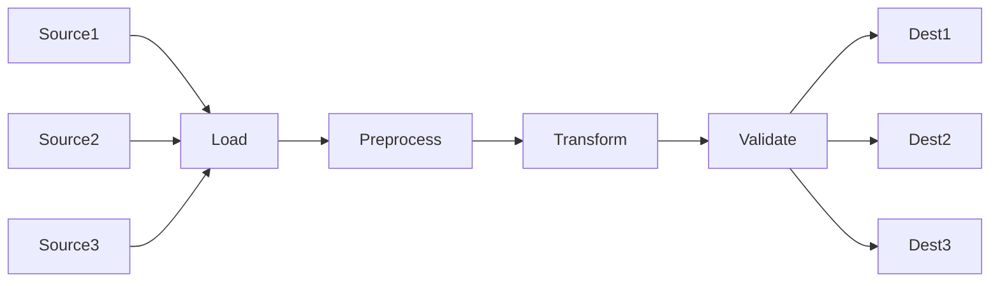

# Goal

Some way to write good, easily extendable, maintainable code to load data, perform transformations and validation on that data

Data from various sources need to be preprocessed, transformed and validated:

The types of preprocessing and transformations should be generic components that can be reused and extended easily.

These loading, preprocessing, transforming and validating steps could be assembled into different pipelines depending on the requirements of the data. 

## Loader

> Loads data from external source (eg. csv) into some representation of data (pandas dataframe)

* pandas dataframe?
* wrapper around pandas dataframe?
* Load from csv
* How to handle csv's of different formats?
* Skip first n lines or last n lines

## DataAdapter (?)
> Represents a set of data (probably a single dataframe)

* Container for a dataframe or other data object

## Transformation

> Represents a single transformation that happens on a single dataframe

* Chainable
* Easily extendable
* Make use of pandas dataframe functions
* View the state of data before and after transformation
* `execute` method contains actual transformation code

## Pipeline

> Ordered sequence of Transformations which are applied in turn

* Initialized with a list of Transformations
* When run, executes each transformation in order

## Validator

# Other stuff

* Visualize pipeline using mermaid?